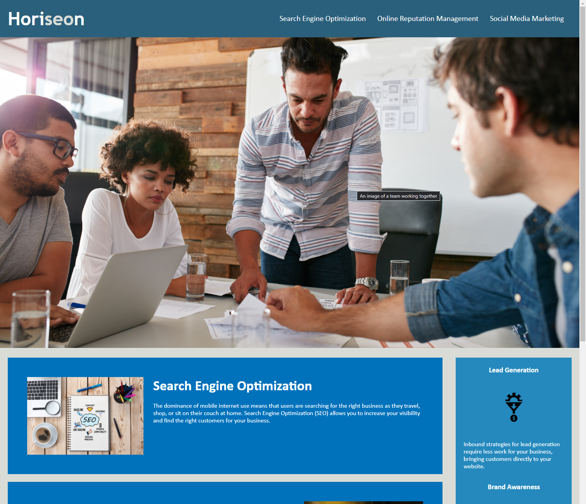

# Horiseon Social Marketing Services

## Description
For this project I refactored this site's html and CSS, to better conform to accessibility best practices. I wanted to become more comfortable with semantic HTML tags. I started by adding alt attributes to each of the images.
As well as using semantic elements, I decided to clean up the CSS code, because there was a lot of repetition. The cards had their own individual classes, but were all styled the same. I applied a class to each of the cards, and consolidated all the duplicated CSS code into the new class.

## Link
[Click here to see the finished site.](https://jcpickens0215.github.io/Horiseon-Social-Marketing/)

## Screenshot
